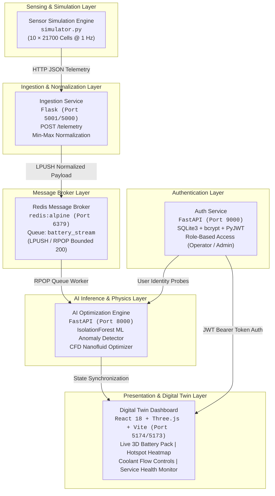
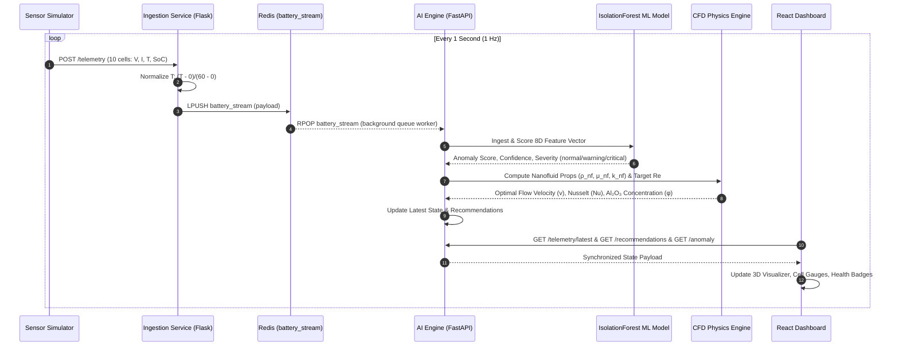
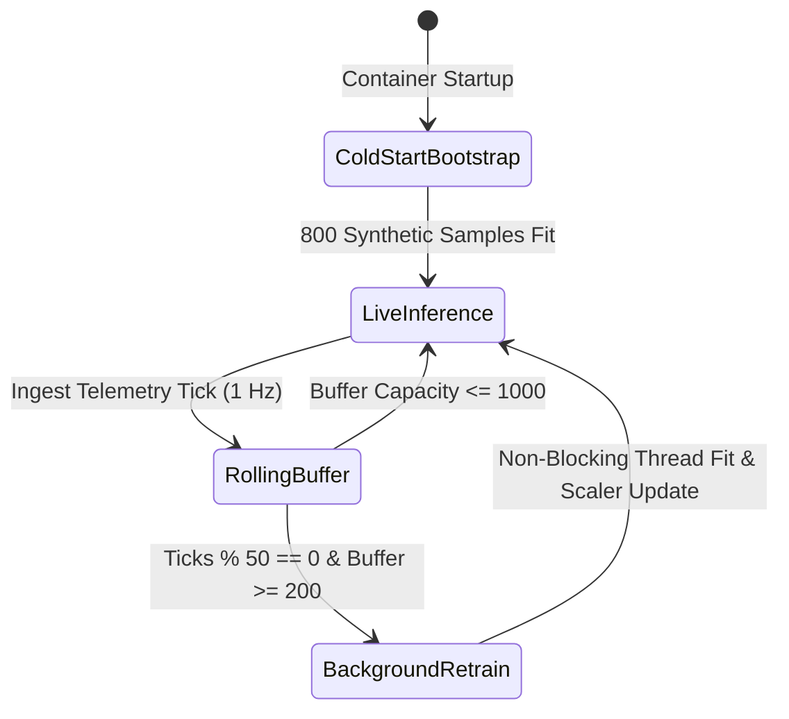

# Battery Thermal Management System (BTMS)
## Comprehensive Technical Documentation & Architecture Specification

---

## 1. Executive Summary & System Overview

The **Battery Thermal Management System (BTMS)** is an enterprise-grade, AI-driven microservices platform engineered to monitor, simulate, and optimize the thermal performance of high-density lithium-ion battery packs for electric vehicles (EVs) and grid storage systems.

```
       ┌─────────────────────────────────────────────────────────────┐
       │                 PHYSICAL TARGET SPECIFICATION               │
       ├──────────────────────────────┬──────────────────────────────┤
       │ Battery Cells                │ 10 × 21700 Cylindrical Cells │
       │ Chemistry                    │ Lithium-ion (NMC/NCA)        │
       │ Enclosure                    │ Aluminum Alloy Casing        │
       │ Microchannel Geometry        │ Embedded Circular Channels   │
       │ Hydraulic Diameter (Dh)      │ 1.0 mm                       │
       │ Channel Length (L)           │ 0.1 m (100 mm)               │
       │ Target Safe Operating Range  │ 15.0°C – 45.0°C              │
       │ Temperature Uniformity (ΔT)  │ < 5.0°C across all cells     │
       │ Coolant Medium               │ Al₂O₃ / Deionized Water NF   │
       └──────────────────────────────┴──────────────────────────────┘
```

### Core Engineering Objectives
1. **Active Hotspot Suppression**: Prevent localized thermal runaway before cell temperatures cross the critical hardware threshold ($T_{crit} = 45.0^\circ\text{C}$).
2. **Temperature Uniformity**: Maintain cell-to-cell thermal gradient $\Delta T = T_{max} - T_{min} < 5.0^\circ\text{C}$ to minimize differential degradation and cell capacity mismatch.
3. **AI-Driven Predictive Cooling**: Use an unsupervised machine learning model (**Isolation Forest**) to detect pre-runaway signatures (voltage sags, current spikes, localized thermal divergence) and proactively tune nanofluid dosing and coolant velocity.
4. **Energy Optimization**: Minimize auxiliary coolant pump parasitic load by dynamically varying flow rates ($Re \in [400, 700]$) and nanoparticle volume fraction ($\phi \in [0.5\%, 3.0\%]$) based on real-time thermal severity.

---

## 2. System Architecture & Data Pipeline

The BTMS architecture follows a cloud-native, loosely coupled **microservices architecture** deployed across isolated Docker network bridges with Redis asynchronous message queues.

### 2.1 Microservices Architecture Diagram



### 2.2 End-to-End Data Pipeline Flow



---

## 3. Technology Stack Specification

| Category | Component / Library | Version | Role in Architecture |
|---|---|---|---|
| **Programming Language** | Python | `3.11` / `3.12` | Core backend runtime for all microservices |
| **Ingestion API** | Flask, Werkzeug | `3.0.3` | Lightweight REST API for sensor telemetry ingestion |
| **CORS Middleware** | Flask-CORS | `4.0.1+` | Cross-Origin Resource Sharing for browser telemetry hooks |
| **Inference Framework** | FastAPI | `0.115.0` | High-performance asynchronous REST API for AI & CFD engine |
| **ASGI Server** | Uvicorn (Standard) | `0.30.6` | Production-grade ASGI server with event loop optimization |
| **Machine Learning** | scikit-learn | `1.5.1` | `IsolationForest` unsupervised tree ensemble for anomaly detection |
| **Numerical Computing** | NumPy | `1.26.4` | Vectorized matrix operations, percentile calculations, feature arrays |
| **Message Broker** | Redis / Redis-Py | `5.0.7` | In-memory message broker with LPUSH/RPOP bounded streaming queues |
| **Authentication** | PyJWT, bcrypt, SQLite3 | `2.9.0 / 4.2.0` | Cryptographic password hashing, JWT bearer tokens, ACID storage |
| **Frontend Framework** | React | `18.3.1` | Single-page digital twin monitoring interface |
| **3D Graphics** | Three.js / React Three Fiber | `0.160+` | Interactive 3D battery module visualizer with heat gradient rendering |
| **Build Tool** | Vite | `5.4.2` | Fast HMR dev server & optimized production asset bundling |
| **UI Styling** | Modern Vanilla CSS | Custom Design System | Dark glassmorphism, responsive CSS grid, zero runtime overhead |
| **Containerization** | Docker & Docker Compose | `v2+` | Multi-container microservice orchestration & bridge networking |
| **Web Server / Proxy** | Nginx Alpine | `1.29.8` | Reverse proxy and production static asset web server |
| **Testing & QA** | Pytest, Requests | `8.3.3` | Data-driven testing, keyword-driven testing, synthetic generators |

---

## 4. Machine Learning & Anomaly Detection Engine

The AI Engine employs an **Unsupervised Isolation Forest** model coupled with continuous online learning to detect battery thermal anomalies without requiring historical labeled failure data.

### 4.1 Mathematical Foundations of Isolation Forest

Isolation Forest isolates anomalous data points by generating random partitioning hyperplanes in an ensemble of $N = 200$ isolation trees ($iTrees$).

1. **Path Length $h(x)$**: The number of edges traversed in an $iTree$ from the root node to the terminating leaf node containing sample $x$.
2. **Average Path Length $c(n)$** for a dataset of size $n$:
   $$c(n) = 2 \left( \ln(n - 1) + 0.5772156649 \right) - \frac{2(n - 1)}{n}$$
3. **Anomaly Score $s(x, n)$**:
   $$s(x, n) = 2^{-\frac{\mathbb{E}(h(x))}{c(n)}}$$
   - When $\mathbb{E}(h(x)) \to 0 \implies s \to 1.0$ (**Strong Anomaly** — isolated in very few splits).
   - When $\mathbb{E}(h(x)) \to c(n) \implies s \to 0.5$ (**Borderline / Indeterminate**).
   - When $\mathbb{E}(h(x)) \to n - 1 \implies s \to 0.0$ (**Definitively Normal**).

### 4.2 8-Dimensional Feature Vector Space

For every individual battery cell $i \in \{0, \dots, 9\}$ at tick $t$, an 8-dimensional feature vector $\mathbf{x}_i \in \mathbb{R}^8$ is assembled:

$$\mathbf{x}_i = \begin{bmatrix}
T_i \\
V_i \\
I_i \\
\text{SoC}_i \\
T_{norm, i} \\
\bar{T}_{pack} \\
\Delta T_{pack} \\
T_i - \bar{T}_{pack}
\end{bmatrix} = \begin{bmatrix}
\text{Cell surface temperature (°C)} \\
\text{Terminal voltage (V)} \\
\text{Discharge/Charge current (A)} \\
\text{State of Charge (\%)} \\
\text{Normalized temperature } (T_i - T_{min}) / (T_{max} - T_{min}) \\
\text{Pack mean temperature } \frac{1}{10}\sum_{j=0}^9 T_j \\
\text{Pack thermal spread } \max(T) - \min(T) \\
\text{Cell deviation from pack mean (°C)}
\end{bmatrix}$$

### 4.3 Online Learning & Retraining Lifecycle



- **Cold-Start Bootstrap**: Synthesizes 800 multivariate samples within known thermodynamic safe operating limits ($20^\circ\text{C} \le T \le 42^\circ\text{C}$, $3.2\text{V} \le V \le 4.1\text{V}$, $1.8\text{A} \le I \le 3.2\text{A}$) so the model scores immediately at Tick 0.
- **Rolling Sample Buffer**: Maintains a thread-safe `collections.deque(maxlen=1000)` of live real-world operating samples.
- **Non-Blocking Retraining**: Every 50 ticks, a background daemon thread refits the `StandardScaler` and `IsolationForest`, enabling the model to learn pack-specific aging, internal impedance shifts, and seasonal ambient temperature profiles.

---

## 5. Computational Fluid Dynamics (CFD) Thermal Optimization

The CFD engine models forced-convection laminar nanofluid flow through circular microchannels embedded within the battery pack aluminum cold plate.

```
                  ┌──────────────────────────────────────────────┐
                  │          EMBEDDED CIRCULAR MICROCHANNEL      │
  Nanofluid In ──►│   ========================================   │──► Nanofluid Out
  (Al₂O₃ + Water) │   ──►  Flow Velocity (v)  ──►  Re ∈ [400, 700] │
                  │   ========================================   │
                  └──────────────────────────────────────────────┘
                       ▲    ▲    ▲    ▲    ▲    ▲    ▲    ▲
                       │    │    │    │    │    │    │    │
                     [C0] [C1] [C2] [C3] [C4] [C5] [C6] [C7] ... [C9]
                                10 × 21700 Li-ion Cells
```

### 5.1 Nanofluid Thermophysical Property Models

An $\text{Al}_2\text{O}_3$ (aluminum oxide) nanoparticle suspension in deionized water is modeled as a function of nanoparticle volume fraction $\phi \in [0.005, 0.030]$:

1. **Effective Density ($\rho_{nf}$)**:
   $$\rho_{nf} = \phi \rho_{\text{Al}_2\text{O}_3} + (1 - \phi) \rho_{\text{water}}$$
   *(where $\rho_{\text{Al}_2\text{O}_3} = 3960.0\text{ kg/m}^3$, $\rho_{\text{water}} = 997.0\text{ kg/m}^3$)*

2. **Effective Dynamic Viscosity ($\mu_{nf}$)** — *Einstein Viscosity Model*:
   $$\mu_{nf} = \mu_{\text{water}} \cdot \exp(2.5 \phi)$$
   *(where $\mu_{\text{water}} = 8.9 \times 10^{-4}\text{ Pa}\cdot\text{s}$)*

3. **Effective Thermal Conductivity ($k_{nf}$)** — *Maxwell Dilute Suspension Model*:
   $$k_{nf} = k_{\text{water}} \cdot (1 + 3\phi)$$
   *(where $k_{\text{water}} = 0.607\text{ W/m}\cdot\text{K}$)*

### 5.2 Flow Velocity & Heat Transfer Correlations

1. **Reynolds Number Inversion**:
   Given target $Re$, the required coolant flow velocity $v$ in microchannels with hydraulic diameter $D_h = 1.0\text{ mm}$ is:
   $$v = \frac{Re \cdot \mu_{nf}}{\rho_{nf} \cdot D_h}$$

2. **Developing Laminar Heat Transfer (Nusselt Number $Nu$)**:
   Using the **Graetz-Dittus-Boelter** correlation for thermally developing laminar flow in a channel of length $L = 0.1\text{ m}$:
   $$Gz = Re \cdot Pr \cdot \frac{D_h}{L}$$
   $$Nu = 3.66 + \frac{0.065 \cdot Gz}{1 + 0.04 \cdot Gz^{2/3}}$$

3. **Convective Heat Transfer Coefficient ($h$)**:
   $$h = \frac{Nu \cdot k_{nf}}{D_h}$$

### 5.3 AI-Coupled Dynamic Cooling Control Matrix

| System Thermal State | ML Anomaly Verdict | Nanoparticle Conc. $\phi$ | Target $Re$ | Flow Velocity $v$ | Heat Transfer $h$ |
|---|---|---|---|---|---|
| **Normal ($T \le 40^\circ\text{C}$)** | `NORMAL` ($s < 0.5$) | $0.5\text{ vol\% } (0.005)$ | $450$ | $\approx 0.395\text{ m/s}$ | $\approx 2450\text{ W/m}^2\text{K}$ |
| **Elevated / Hotspot** | `WARNING` ($0.5 \le s < 0.8$) | $1.5\text{ vol\% } (0.015)$ | $580$ | $\approx 0.518\text{ m/s}$ | $\approx 3120\text{ W/m}^2\text{K}$ |
| **Critical / Spike ($T > 45^\circ\text{C}$)** | `CRITICAL` ($s \ge 0.8$) | $3.0\text{ vol\% } (0.030)$ | $680$ | $\approx 0.621\text{ m/s}$ | $\approx 3890\text{ W/m}^2\text{K}$ |

---

## 6. Functional Features Breakdown

### 6.1 Real-Time 3D Digital Twin & 2D Pack Matrix
- **3D Interactive Battery Pack**: Three.js WebGL canvas displaying all 10 cylindrical 21700 cells arranged in the aluminum cooling jacket.
- **Dynamic Heat Gradient**: Real-time shader color-mapping from emerald green ($20^\circ\text{C}$) to electric cyan ($30^\circ\text{C}$), amber ($40^\circ\text{C}$), and flashing crimson ($>45^\circ\text{C}$).
- **Interactive Inspection**: Click on any cell in the 3D pack or 2D grid to inspect instantaneous voltage, current, temperature, SoC, and ML anomaly classification.

### 6.2 ML Anomaly & Pre-Runaway Warning Center
- **Per-Cell Anomaly Scores**: Real-time gauge for each cell showing Isolation Forest confidence and normalized deviation score.
- **Pack-Wide Severity Banner**: Instant warning notifications when localized cell divergence ($T_{cell} - \bar{T}_{pack}$) exceeds statistical limits.
- **Model Health Telemetry**: Live inspection of Isolation Forest tree depth, training sample count, and retrain generation counter.

### 6.3 CFD Nanofluid Control Panel
- **Active Coolant Dosing**: Live display of $\text{Al}_2\text{O}_3$ nanoparticle volumetric concentration ($0.5\% - 3.0\%$).
- **Flow Velocity Meter**: Real-time inverted flow velocity ($v\text{ in m/s}$) and Reynolds number ($Re$).
- **Thermophysical Properties**: Dynamic calculation of effective nanofluid density $\rho_{nf}$, dynamic viscosity $\mu_{nf}$, and thermal conductivity $k_{nf}$.

### 6.4 Operator Authentication & Role-Based Access Control (RBAC)
- **FastAPI Auth Microservice**: Secure endpoints for user registration, login, profile inspection, and audit logging.
- **Cryptographic Security**: Passwords salted and hashed with `bcrypt` (12 rounds).
- **JWT Bearer Token Workflow**: Stateless HMAC-SHA256 tokens with configurable expiration (default 24 hours).
- **Role Permissions**: Separation of access between `operator` (view-only telemetry & diagnostics) and `admin` (override CFD setpoints, trigger retrain, modify alert thresholds).

### 6.5 Live Microservices Health & Latency Monitor
- **Probing Endpoints**: Automated pinging of `/health` endpoints on all microservices every 5 seconds.
- **Dynamic Origin Probing**: Automatically detects browser origin and measures network round-trip latency in milliseconds.
- **Visual Status Badges**: Microservice cards display green/red status indicators, active ports, runtime technology tags, and live latency bars.

---

## 7. Complete API Reference

### 7.1 AI Optimization Engine (`http://localhost:8000`)

#### `GET /health`
Returns service availability, model readiness, and Redis connectivity.
```json
{
  "service": "ai-engine",
  "status": "healthy",
  "redis": true,
  "model_ready": true,
  "samples_seen": 420
}
```

#### `GET /telemetry/latest`
Returns the most recent 10-cell telemetry payload processed from the queue.
```json
{
  "status": "ok",
  "telemetry": {
    "tick": 245,
    "timestamp": "2026-09-23T13:45:00.123Z",
    "cells": [
      {
        "cell_id": 0,
        "temperature": 28.45,
        "temperature_norm": 0.4741,
        "voltage": 3.68,
        "current": 2.48,
        "soc": 98.2,
        "is_spike": false
      }
    ]
  }
}
```

#### `GET /recommendations`
Returns CFD coolant flow rate, nanoparticle volume fraction, and physics parameters.
```json
{
  "status": "ok",
  "recommendation": {
    "tick": 245,
    "severity": "normal",
    "ml_severity": "normal",
    "ml_confidence": 0.88,
    "re_target": 450.0,
    "nanofluid_vol_pct": 0.5,
    "flow_velocity_mps": 0.395,
    "nusselt": 14.82,
    "heat_transfer_coeff": 2450.1,
    "max_temp": 32.1,
    "avg_temp": 28.6,
    "delta_t": 4.8
  }
}
```

#### `GET /anomaly`
Returns per-cell Isolation Forest anomaly classifications and confidence scores.
```json
{
  "status": "ok",
  "anomaly": {
    "pack_anomaly": false,
    "pack_severity": "normal",
    "pack_confidence": 0.88,
    "anomalous_cells": [],
    "cells": [
      {
        "cell_id": 0,
        "anomaly_score": 0.1245,
        "is_anomaly": false,
        "confidence": 0.751,
        "label": "NORMAL"
      }
    ]
  },
  "model": {
    "model_ready": true,
    "train_count": 5,
    "buffer_size": 1000,
    "bootstrap_samples": 800
  }
}
```

---

### 7.2 Authentication Service (`http://localhost:9000`)

#### `POST /auth/register`
Register a new operator or administrator account.
- **Request Body**:
  ```json
  {
    "username": "operator1",
    "email": "operator1@btms.local",
    "password": "SecurePassword123!",
    "role": "operator"
  }
  ```
- **Response**: `201 Created` with JWT access token and user profile.

#### `POST /auth/login`
Authenticate credentials and issue JWT bearer token.
- **Request Body**:
  ```json
  {
    "username": "operator1",
    "password": "SecurePassword123!"
  }
  ```
- **Response**: `200 OK`
  ```json
  {
    "access_token": "eyJhbGciOiJIUzI1NiIsInR5cCI6IkpXVCJ9...",
    "token_type": "bearer",
    "user": {
      "id": 1,
      "username": "operator1",
      "email": "operator1@btms.local",
      "role": "operator"
    }
  }
  ```

#### `GET /auth/me`
Validate active JWT token and retrieve operator identity.
- **Headers**: `Authorization: Bearer <access_token>`
- **Response**: `200 OK` with user record.

#### `GET /auth/health`
Health check endpoint for container orchestrators.
```json
{
  "status": "ok",
  "service": "auth_service"
}
```

---

### 7.3 Ingestion Service (`http://localhost:5001`)

#### `POST /telemetry`
Accepts raw sensor JSON, normalizes temperatures, and enqueues to Redis `battery_stream`.
- **Request Body**:
  ```json
  {
    "tick": 1,
    "timestamp": "2026-09-23T13:45:00Z",
    "cells": [
      { "cell_id": 0, "temperature": 29.5, "voltage": 3.7, "current": 2.5, "soc": 100.0 }
    ]
  }
  ```
- **Response**: `202 Accepted` (`{"status": "queued", "tick": 1}`)

#### `GET /health`
Health check and Redis connectivity verification.
```json
{
  "service": "ingestion",
  "status": "ok",
  "redis": "ok"
}
```

---

## 8. Testing & Quality Assurance Architecture

The repository includes a 3-tier testing framework located in [`/tests`](file:///Users/shashanksathish/BTMS/tests):

```
tests/
├── conftest.py                   # Pytest fixtures and mock client configurations
├── requirements.txt              # Testing framework dependencies
├── data_driven/                  # Data-Driven Testing (DDT)
│   ├── datasets/
│   │   ├── cfd_cases.csv         # Parameterized CFD Reynolds/Concentration cases
│   │   └── ingestion_cases.csv   # Boundary & edge case telemetry payloads
│   ├── test_cfd_engine.py        # Pytest test cases validating CFD calculations
│   └── test_ingestion_api.py     # Pytest test cases validating ingestion API
├── keyword_driven/               # Keyword-Driven Testing (KDT)
│   ├── test_suite.csv            # Tabular keyword action test cases
│   ├── keywords.py               # Keyword implementation engine (CONNECT, POST, ASSERT)
│   └── keyword_runner.py         # Autonomous execution harness & reporting
└── synthetic/                    # AI Synthetic Telemetry Generation
    ├── generator.py              # Multi-strategy synthetic data generator
    └── generated/                # Output directory for synthetic dataset batches
```

### 8.1 1. Keyword-Driven Testing (KDT)
Executes human-readable, table-based test cases defined in [`tests/keyword_driven/test_suite.csv`](file:///Users/shashanksathish/BTMS/tests/keyword_driven/test_suite.csv). Keywords include:
- `CONNECT_SERVICE <url>`: Verifies service HTTP reachability.
- `POST_TELEMETRY <payload>`: Posts sensor telemetry to the ingestion endpoint.
- `ASSERT_STATUS <code>`: Asserts HTTP response status codes.
- `ASSERT_ANOMALY <expected>`: Validates ML classification results.

### 8.2 2. Data-Driven Testing (DDT)
Parameterized test suites running hundreds of boundary conditions from CSV datasets:
- **CFD Verification**: Tests fluid density $\rho_{nf}$, dynamic viscosity $\mu_{nf}$, and Reynolds number inversion across edge cases ($\phi = 0.0\% \dots 5.0\%$).
- **Ingestion Normalization**: Tests boundary temperatures ($-10^\circ\text{C}, 0^\circ\text{C}, 45^\circ\text{C}, 60^\circ\text{C}, 120^\circ\text{C}$).

### 8.3 3. AI Synthetic Data Generation Engine
Located in [`tests/synthetic/generator.py`](file:///Users/shashanksathish/BTMS/tests/synthetic/generator.py). Provides 5 generation strategies:
1. **Random Baseline (Monte Carlo)**: Pure stochastic variation for distribution testing.
2. **Physics-Constrained**: Gaussian perturbations bound to standard $I^2R$ Joule heating laws.
3. **Scenario-Driven**: Injects named operational faults (*Rapid Highway Acceleration*, *Thermal Runaway Propagation*, *Sensor Drift*, *Degraded Cell Internal Short*).
4. **Adversarial**: Stress-tests boundary limits, corrupt payloads, and extreme temperature swings.
5. **Augmented**: Multivariate interpolation between safe and failure trajectories.

---

## 9. Deployment & Execution Guide

### Mode A: Full Containerized Stack (Docker Compose)
Runs all 6 microservices in isolated Linux containers with dedicated bridge networking:

```bash
# Build and launch all microservices in the background
docker compose up --build -d

# View live streaming container logs
docker compose logs -f

# Verify container health status
docker compose ps

# Teardown containers and networks
docker compose down
```

### Mode B: Lightweight Standalone Dev Server
Runs the battery pack simulation, Isolation Forest ML model, and CFD optimization engine in a single process without Docker or Redis dependencies:

```bash
# 1. Start the unified backend (FastAPI on Port 8000)
python dev_server.py

# 2. Start the Auth Service (FastAPI on Port 9000)
python -m uvicorn auth_service.main:app --port 9000

# 3. Start the Ingestion Service (Flask on Port 5001)
python -c "from ingestion.app import app; app.run(host='0.0.0.0', port=5001)"

# 4. Start the React Frontend Dashboard (Vite on Port 5173/5174)
cd dashboard
npm install
npm run dev
```

### Mode C: Running the Test Suites

```bash
# Run all Data-Driven Pytest suites
pytest tests/data_driven/ -v

# Run the Keyword-Driven Testing suite
python tests/keyword_driven/keyword_runner.py

# Generate a synthetic dataset batch (200 ticks across all strategies)
python tests/synthetic/generator.py --strategy all --ticks 200 --seed 42
```

---

## 10. Summary Matrix: Microservice Ports & Boundaries

| Service Name | Internal Port | Host Port | Protocol | Primary Responsibilities |
|---|---|---|---|---|
| **`message-broker`** | `6379` | `6379` | TCP / Redis | Telemetry queuing, decoupling ingestion from AI inference |
| **`ingestion-service`** | `5000` | `5001` | HTTP / Flask | Telemetry validation, min-max normalization, Redis enqueuing |
| **`ai-engine`** | `8000` | `8000` | HTTP / FastAPI | Isolation Forest anomaly scoring, online retraining, CFD nanofluid calculations |
| **`simulator`** | *N/A* | *N/A* | HTTP Client | Autonomous 10-cell physical sensor simulation & thermal spike injection |
| **`auth-service`** | `9000` | `9000` | HTTP / FastAPI | SQLite user database, password hashing, JWT token authentication |
| **`dashboard`** | `80` (Docker) / `5173` (Dev) | `5174` / `5173` | HTTP / React | Digital twin 3D visualization, hotspot matrix, active cooling telemetry |
