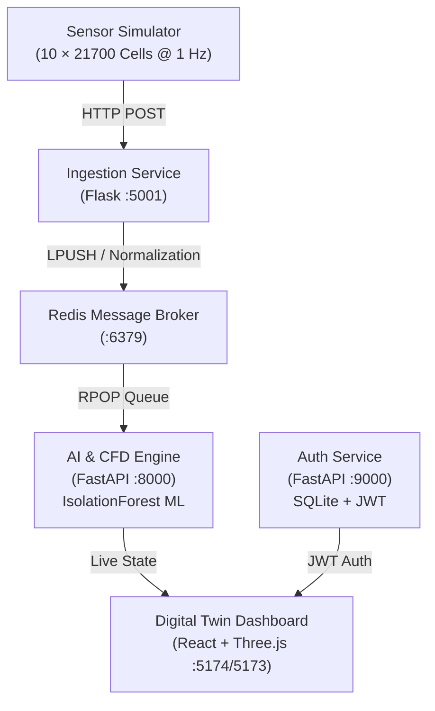

# Battery Thermal Management System (BTMS)

[](file:///Users/shashanksathish/BTMS/docker-compose.yml)
[](https://fastapi.tiangolo.com)
[](https://react.dev)
[](https://threejs.org)
[](https://scikit-learn.org)
[](file:///Users/shashanksathish/BTMS/test_report.txt)

> **AI-Driven Predictive Cooling & Digital Twin Platform for High-Density 21700 Li-Ion Battery Packs**

---

## ⚡ Overview

The **Battery Thermal Management System (BTMS)** optimizes active cooling for high-performance battery packs using an AI-driven microservices architecture coupled with Computational Fluid Dynamics (CFD).

```
                      ┌────────────────────────────────────────┐
                      │          10 × 21700 Li-Ion Pack        │
                      │  ====================================  │
                      │   ──► Al₂O₃ Nanofluid Microchannels ──►│
                      │  ====================================  │
                      └────────────────────────────────────────┘
                                           │
                        ┌──────────────────┴──────────────────┐
                        ▼                                     ▼
           AI Anomaly Detection (ML)               CFD Coolant Optimization
        • IsolationForest (200 trees)           • Dynamic Reynolds Re ∈ [400, 700]
        • 8D Multivariate Feature Vector        • Al₂O₃ Nanofluid Vol% (0.5% - 3.0%)
        • Pre-Runaway Hotspot Detection         • Graetz-Dittus-Boelter Nu Correlation
```

---

## 🚀 Key Features

- **Unsupervised ML Anomaly Detection**: `scikit-learn` Isolation Forest analyzing an 8-dimensional feature vector per cell (voltage sags, current, temperature, SoC, cell-to-pack gradients).
- **Continuous Online Retraining**: Cold-start bootstrap (800 samples) and periodic background refitting every 50 ticks to adapt to pack aging and ambient shifts.
- **AI-Coupled Nanofluid Cooling**: Dynamically calculates effective nanofluid properties ($\rho_{nf}$, $\mu_{nf}$, $k_{nf}$), flow velocities, and Nusselt numbers ($Nu$).
- **Interactive 3D Digital Twin**: Three.js WebGL pack visualizer with real-time heat gradient shaders and per-cell diagnostics.
- **Enterprise Authentication & RBAC**: Dedicated FastAPI authentication service with SQLite, `bcrypt` password hashing, and JWT bearer tokens.
- **3-Tier Testing Suite**: Data-Driven Testing (DDT), Keyword-Driven Testing (KDT), and AI Synthetic Data Generation (**420 tests passing, 100% pass rate**).

---

## 🏗️ Architecture



For complete technical specifications, see **[BTMS_DOCUMENTATION.md](file:///Users/shashanksathish/BTMS/BTMS_DOCUMENTATION.md)**.

---

## 🛠️ How to Run

### 📋 Prerequisites
- **Python**: `3.11` or `3.12` installed
- **Node.js**: `18.0+` & `npm` installed
- **Docker & Docker Compose**: (Optional, for full containerized stack)

---

### Method 1: Full Docker Compose Stack (Production Mode)

Runs all 6 microservices in isolated Docker containers with automated Redis networking.

```bash
# 1. Clone the repository
git clone https://github.com/shash-17/BTMS.git
cd BTMS

# 2. Build and start all 6 containers
docker compose up --build

# (Optional) To run in the background (detached mode):
docker compose up --build -d

# View live container logs:
docker compose logs -f

# Stop all services:
docker compose down
```

---

### Method 2: Standalone Local Dev Mode (No Docker or Redis required)

For instant local development, the system includes a unified dev server (`dev_server.py`) that simulates telemetry and runs the ML engine in-memory.

#### 1. Start the Unified Backend & ML Engine
```bash
# From the project root:
python dev_server.py
```
*Runs FastAPI on `http://localhost:8000` with live ML scoring and CFD calculations.*

#### 2. Start the Auth Service (In a new terminal)
```bash
python -m uvicorn auth_service.main:app --host 0.0.0.0 --port 9000
```
*Runs Auth Service on `http://localhost:9000`.*

#### 3. Start the Ingestion Service (In a new terminal)
```bash
python -c "from ingestion.app import app; app.run(host='0.0.0.0', port=5001)"
```
*Runs Ingestion Service on `http://localhost:5001`.*

#### 4. Start the React Frontend Dashboard (In a new terminal)
```bash
cd dashboard
npm install
npm run dev
```
*Runs the Digital Twin interface on `http://localhost:5173`.*

---

## 🌐 Live Endpoints & Service Map

| Service | Mode | URL | Swagger Docs / Notes |
|---|---|---|---|
| **Digital Twin UI** | Docker | [`http://localhost:5174`](http://localhost:5174) | Nginx production build |
| **Digital Twin UI** | Local Dev | [`http://localhost:5173`](http://localhost:5173) | Vite HMR dev server |
| **AI CFD & ML Engine** | All | [`http://localhost:8000`](http://localhost:8000) | Interactive API Docs: [`/docs`](http://localhost:8000/docs) |
| **Auth Service** | All | [`http://localhost:9000`](http://localhost:9000) | Interactive API Docs: [`/auth/docs`](http://localhost:9000/auth/docs) |
| **Ingestion Service** | All | [`http://localhost:5001/health`](http://localhost:5001/health) | Sensor telemetry endpoint (`/telemetry`) |
| **Message Broker** | Docker | `localhost:6379` | Redis stream queue (`battery_stream`) |

---

## 🧪 Testing & Quality Assurance

Run all test suites locally:

```bash
# 1. Run Data-Driven Pytest Suites (CFD physics & Ingestion normalizations)
pytest tests/data_driven/ -v

# 2. Run Keyword-Driven Test Harness (Tabular action execution)
python tests/keyword_driven/runner.py

# 3. Generate & Validate AI Synthetic Telemetry Datasets
python tests/synthetic/generator.py --strategy all --ticks 100 --seed 42
python tests/synthetic/validate_synthetic.py
```

### Complete Test Results

The test suite consists of **420 total test cases across 3 testing tiers (100% pass rate)**:

```
================================================================================
1. EXECUTIVE SUMMARY & TEST METRICS
================================================================================
  Test Category                  Executed    Passed    Failed    Errors    Pass Rate
  --------------------------------------------------------------------------------
  Data-Driven Tests (Pytest)          185       185         0         0       100.0%
  Keyword-Driven Tests (KDT)           25        25         0         0       100.0%
  Synthetic Data Validations          210       210         0         0       100.0%
  --------------------------------------------------------------------------------
  TOTAL                               420       420         0         0       100.0%
```

See **[test_report.txt](file:///Users/shashanksathish/BTMS/test_report.txt)** for the complete execution log.

---

## 🔧 Troubleshooting & Port Cleanup

If port 8000, 9000, or 5001 is already in use by a background process, free them with:

```bash
# Terminate any running dev server or uvicorn processes:
pkill -f dev_server.py
pkill -f "uvicorn"
lsof -ti:8000,9000,5001 | xargs kill -9 2>/dev/null
```

---

## 📚 Detailed Documentation

For comprehensive mathematical proofs, Navier-Stokes / Graetz derivations, ML anomaly detection architecture, and full schema references, see **[BTMS_DOCUMENTATION.md](file:///Users/shashanksathish/BTMS/BTMS_DOCUMENTATION.md)**.
